# BankSystem_OOP

BankSystem_OOP is a complete banking management system developed in C++ using Object-Oriented Programming (OOP) principles. Built with Visual Studio 2022, the system offers a full range of features to manage clients, users, transactions, currency exchange, and user access control through a clean console-based interface.

## Screenshots

 Login Screen

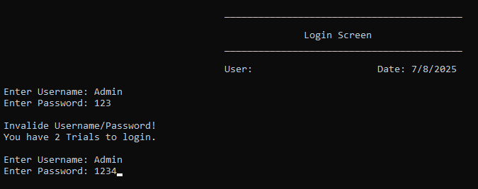

 Main Menu

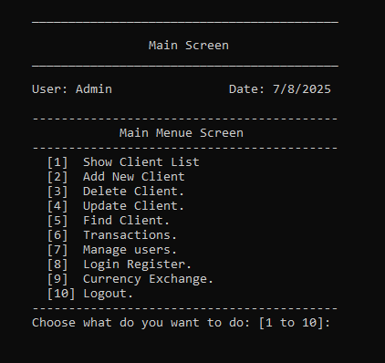

 Clients List

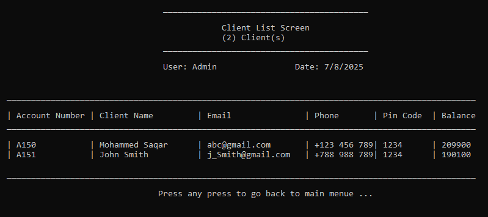

 Add Client

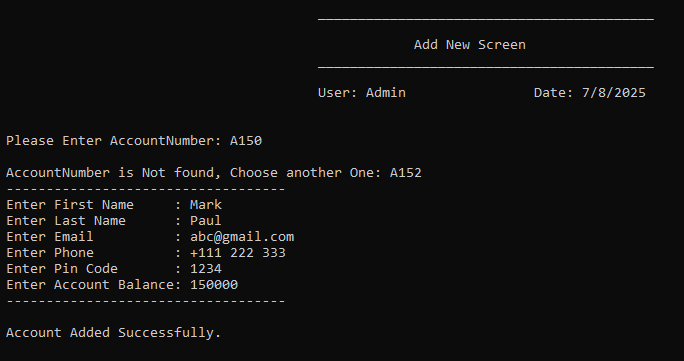

 Update Client

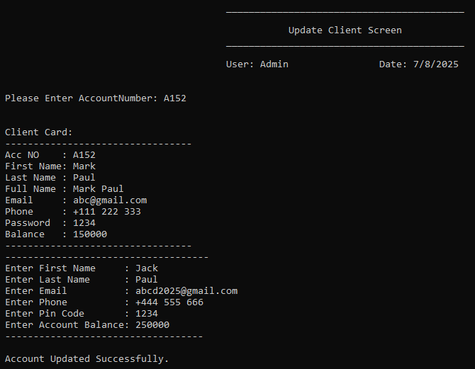

 Delete Client

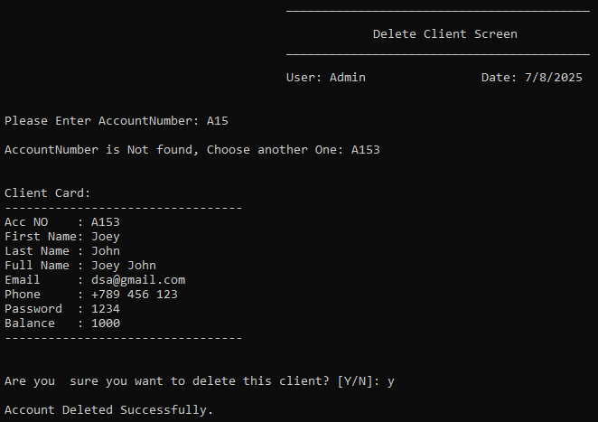

 Search Client

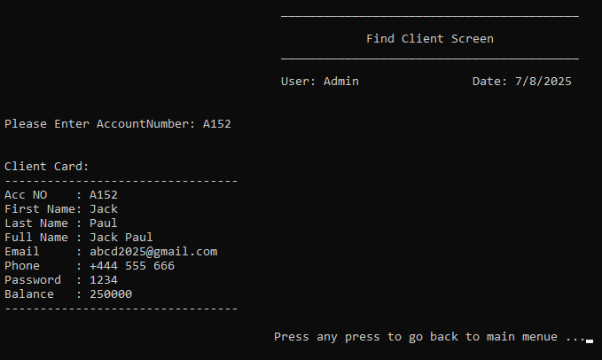

 Transactions Menu

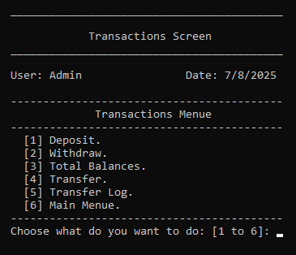

 Deposit

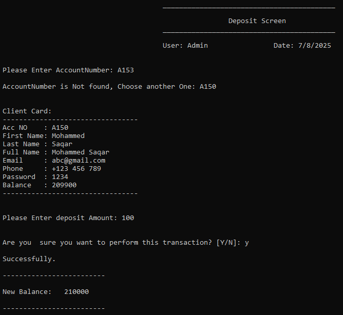

 Withdrawal Denied

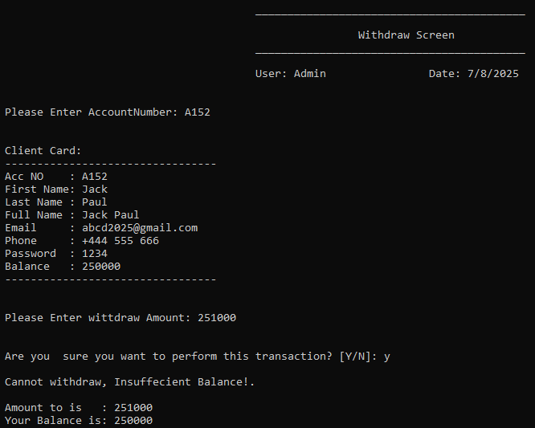

 Withdraw

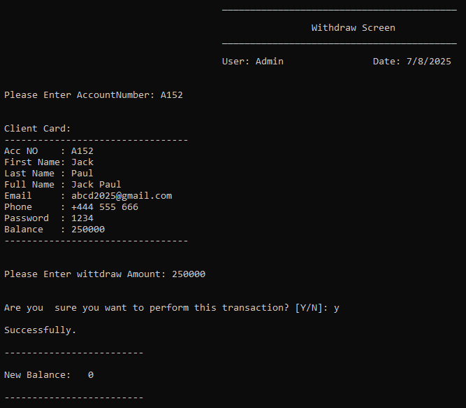

 Total Balances

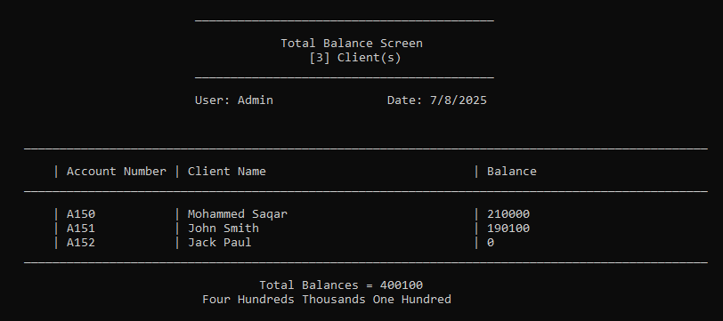

 Transfer

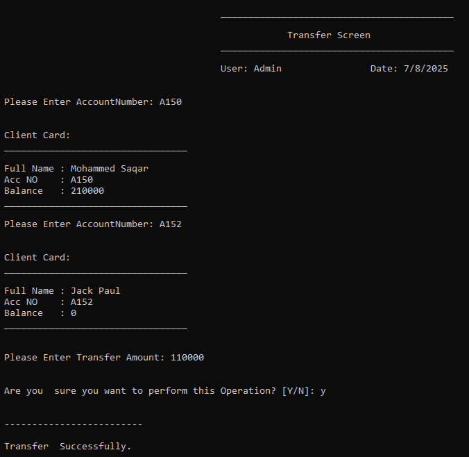

 Transfer Log

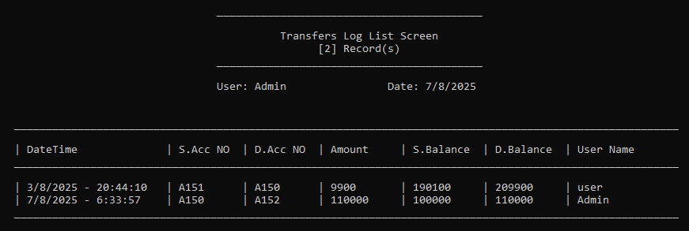

 User Management
 
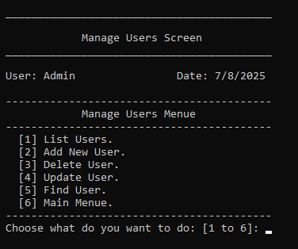

 Users List

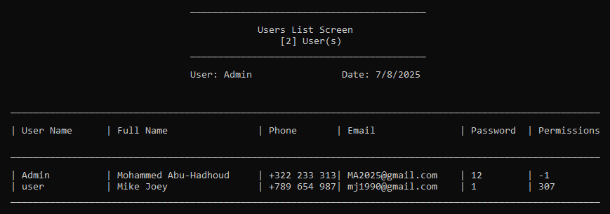

 Add User

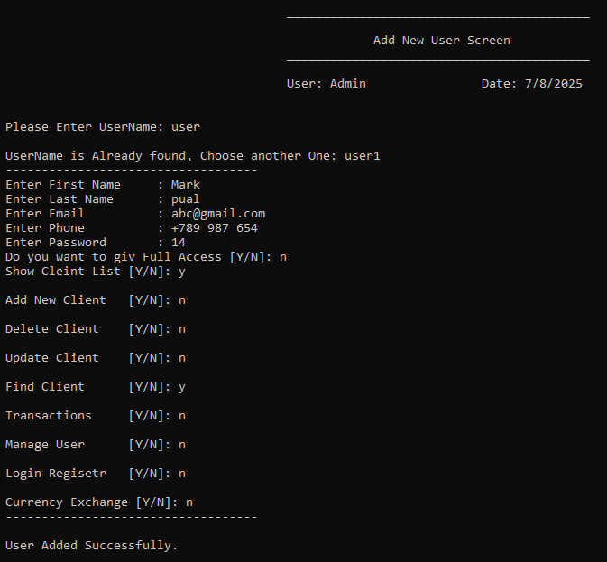

 Currency Menu

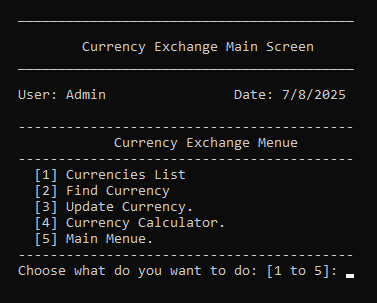

 Currency List

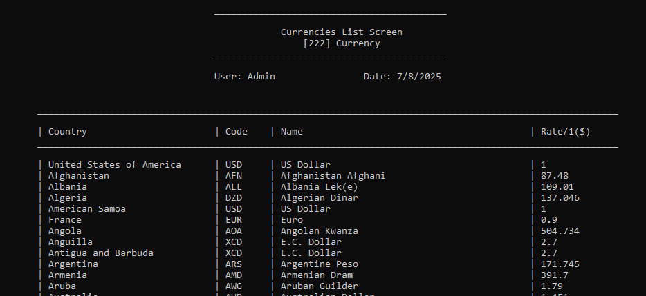

 Currency Exchange

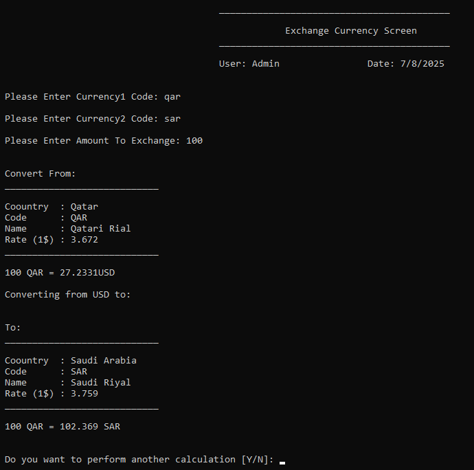

 Login Activity Log

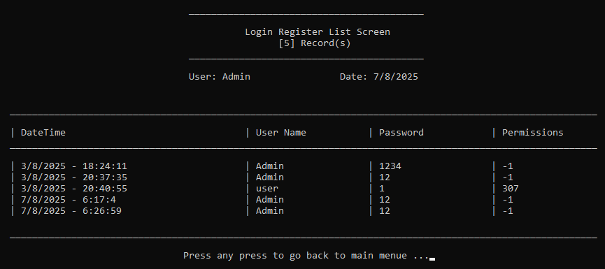 

## Features

- Login system with a maximum of three attempts before program termination
- Encrypted password storage for user security
- Current username and timestamp displayed across all screens
- Full client management: add, update, delete, search, and list clients
- Full user management: add, update, delete, search, and list users
- Prevent duplicate account numbers or usernames
- Transaction operations:
  - Deposit and withdraw
  - Prevent withdrawal of amounts greater than account balance
- Transfer operations:
  - Transfer between client accounts
  - Prevent transferring amounts exceeding available balance
  - Log all transfers with username, date, and time
- Currency exchange system:
  - Convert between currencies (e.g., from SAR to USD)
  - Manage and update exchange rates
- Activity logs:
  - All login attempts recorded in a login register
  - All transfers recorded in a transfer register
  - View logs via dedicated screens
- Logout returns the user to the login screen automatically
- Input validation for existing accounts or users before performing operations

## Joiner Developer: Mohammed Adlan

GitHub: MohammedAdlan
